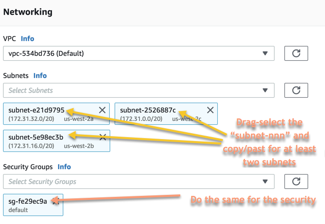

# AWS RoboMaker Workshop - re:Invent 2018

Welcome! In this workshop you become familiar with the AWS RoboMaker services that provide you the tools to develop, integrate with other AWS services, and package robot code ready for deployment onto physical robots. Throughout there will be mention of the Robot Operating System, or [ROS](http://www.ros.org/) related concepts and tools. The workshop will not go into depth on these except for the commands used and what they do.

Having said that, if you do have questions, please do ask any of the workshop staff and we will get you answers.

This workshop is designed to cover setup of your AWS account, run through three application, and then clean up resources at the end so you are not being charged for them. Please read through and complete each activity before starting the next. If something doesn't look correct, please ask for assistance as we want to make sure the concept covered are well understood.

The account setup is covered in this document, and then each activity is separate document you can pull up.

Again, thank you for your time attending this workshop. Let's get started!

## Pre-workshop setup

To complete this workshop you need an AWS account with administrative permissions, as this is needed to create or modify resources and allow AWS RoboMaker to interact with services on your behalf. Please follow these steps to setup your account:

1. [Log in via the AWS console](https://console.aws.amazon.com/) and set your region to Oregon from the top menu to right of your username. All activities will reference Oregon (us-west-2). 

   :exclamation: All code is currently set only for us-west-2, using any other regions will not work in this iteration.

2. Apply the credit to your account (*Your username->Account->Credits)*. This amount will cover AWS usage for the workshop, as long as you clean up resources at the end.

3. Create a "cheat sheet" text file to hold values needed for the activities. When you see "store for later use", this is where the details should go and be referenced.

4. Create an S3 bucket that will hold all of the AWS RoboMaker related objects. We will reference `df-bucket` throughout such as `s3://df-bucket/logfiles`, but make sure the name is unique, but short. Store the bucket name for later use,

5. Open Kinesis Video Streams and create a new stream:

   * **Stream name**: *roboMaker_TurtleBot3*
   * Uncheck *Use default settings*
   * **Change Data retention period**: to 1 hour
   * Create stream

   Note the Stream name (`roboMaker_TurtleBot3`) for later use.

6. Ensure the default VPC is available for use and has Internet access (either public IP address or NAT gateway). Make sure you are looking at Default VPC in us-west-2!

7. Finally, from the RoboMaker console, create a simulation job (which you will cancel), to get the subnet ID's and security group ID:

   1. *RoboMaker->Simulation jobs->Create simulation job*

   2. Ignore the first two blocks, and in the Networking block, select the *VPC* you would like to use

   3. This will populate the available *Subnets* and *Security Groups*

   4. Under Subnets select two or more from the drop-down, then you can drag-select with your mouse the identifiers for them and place them in your cheat sheet for further use.

   5. Do the same for the *Security Groups* section (only select a single Security Group).

   6. It should look similar to this:

      

## Activities

Below are the activities setup for this workshop. Right-click on each and open in a new tab or window. Once an activity has been completed, you can close out the tab, come back here, and do the same for the next one.

:exclamation: Once all activities are done, please then complete the account cleanup section at the bottom of this page.

### [1 - Development environment and HelloWorld](./1_dev_hello.html)

In this activity you will setup a development environment and build, bundle, and simulate a "Hello World" application.

### [2 - Cloud service integrations to do object detection](./2_dog_finder.html) 

In this activity you will explore other methods for building and deploying applications in the development environment, and see how an application can directly interact with AWS services in a ROS native manner (nodes and topics), and how any AWS service can be used through normal SDK calls (python boto3 in this instance).

## Workshop cleanup

AWS only charges for consumed resources. Please follow the steps below to shutdown or delete resources so you will not be charged.

1. Delete the S3 bucket by selecting the bucket then clicking *Delete* from above the list of buckets.
2. From the AWS RoboMaker console, make sure there are no simulation jobs in progress. If there are, select them and click *Actions->Cancel*.
3. Also from the AWS RoboMaker Console, from Development->Development environments, click on the environment name, *Edit*, then *Delete* from the AWS Cloud9 console.
4. In the CloudWatch Console, under *Logs*, select each LogGroup (`/aws/robomake/SimulationJobs` and `dogfinder_workshop`) and click *Actions->Delete log group*.
5. In Kinesis Video Streams, delete your stream which will release the stored video content.
6. In IAM, delete the *Cloud9-RoboMakerWorkshop* role.